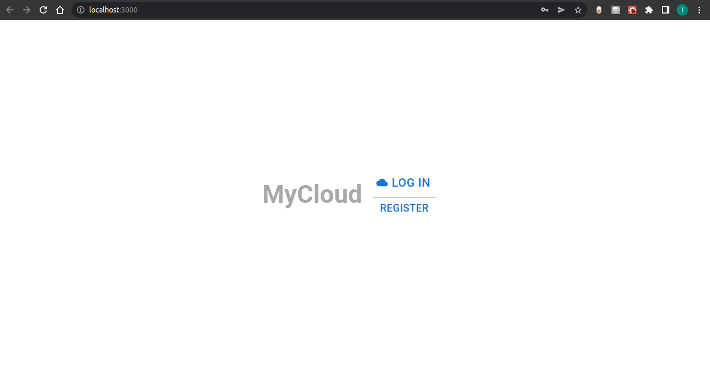

# MyCloud

### Building & Running
Right now all you can do is view the login screen.

But run `npm install` and edit the MySQL connection string in `server/server.js` to a valid user in a mysql instance.

Then run `npm run start` in the main directory to start the react-server and open the page, and then the same thing in the server
directory -- the react demo-server will proxy API calls to the node-server.

Right now, though, the frontend isn't doing any calls to the backend.

